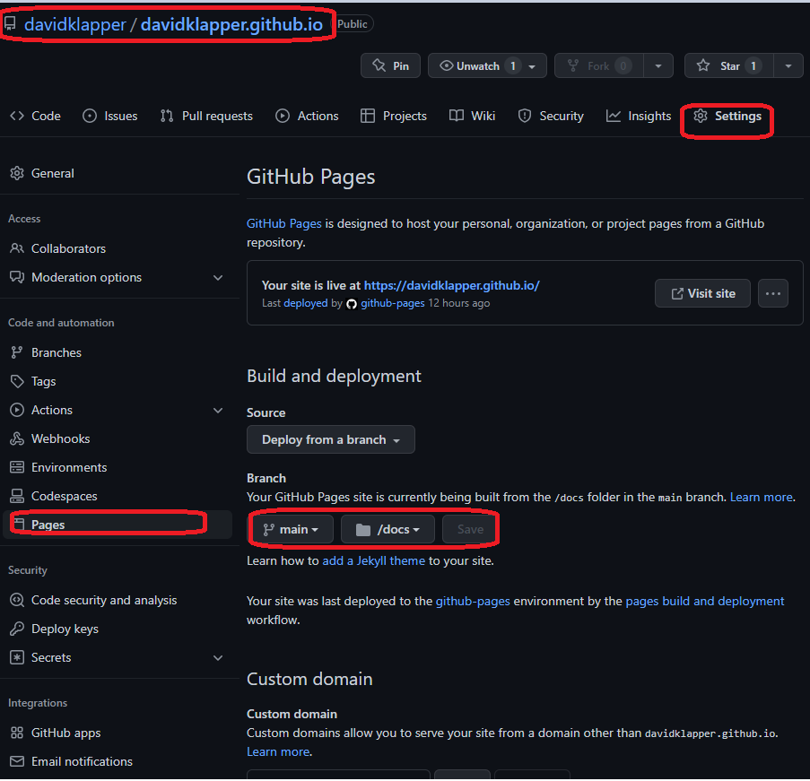

# David Klapper

## Explaining this repo
1. This repo is a flask and frozen-flask application. code in ```docs``` is autogenerated, do not touch manually.
2. Flask app ```david.py``` creates the website, embeds content into the ```jinja2``` templates found in ```templates```.
2a. Running ```python3 david.py``` creates the website locally to view changes. It also runs the site _dynamically_, ie it has the ability to do interactive features, which we will use in the future.
3. ```freezer.py``` creates the ```docs``` content from ```david.py```. This creates a static page so that we can load to GitHub Pages (davidklapper.github.io).
3a. Running ```python3 freezer.py``` creates ```docs```, which have to be commmitted in order for github to deploy the new code.
3b. Github Pages can only do static content hosting, which is fine for the personal site.
4. One has to update settings in repo to serve from ```docs```. See the below image


## Who am I?
I am a software and hardware engineer. My principle interests are automation for hardware and software in complex analog and digital synthesis.

I am also deploying AI solutions with custom FPG"A and G"PU solutions.

## Past projects
[My personal site](https://github.com/davidklapper/davidklapper.github.io.git)

## Sythesized Art (these are not real people)
 
 
 
 
 